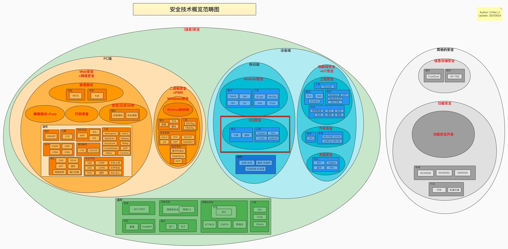

# iOS安全概览

* iOS安全
  * 所属范畴
    * 从大的信息安全范畴，属于：`信息安全` 中 `设备端` 中 `移动端` 中 `iOS安全`
      * 
        * 详见：[信息安全概览 安全概览](https://book.crifan.org/books/information_security_overview/website/security_overview/)
    * iOS开发，从`安全`领域的`攻防`角度分：
      * 反方的 `攻`：`iOS逆向`=`iOS破解`=`iOS攻击`
        * [iOS逆向开发](https://book.crifan.org/books/ios_reverse_dev/website/)
      * 正方的 `防`：`iOS安全`=`iOS防护`
