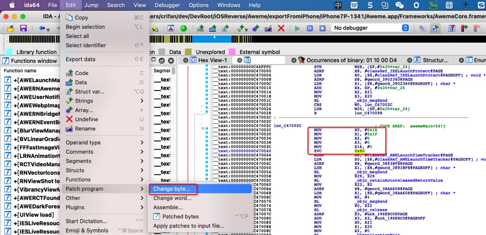

# 反调试

TODO：

* 【整理】iOS反越狱相关：反调试 反反调试
* 【已解决】iOS中正向调用ptrace的PT_DENY_ATTACH防止调试
* 【已解决】iOS中的caddr_t类型的定义
* 【已解决】debugserver启动iOS的app抖音报错：Segmentation fault 11
* 
* 【已解决】抖音反反调试：把二进制AwemeCore的svc 0x80指令替换成nop指令
* 【已解决】Mac中用IDA实现抖音二进制AwemeCore的svc 0x80替换成nop指令

---

iOS安全防护技术之一是

* `反调试`
  * 防止你的iOS的app被别人逆向调试
  * 加了反调试后的效果
    * 现象：别人用调试工具去调试你的iOS的app，会报错退出，从而无法继续调试
      * 举例
        * `debugserver`会报错：`Segmentation fault 11`
  * 反调试实现手段
    * ptrace的PT_DENY_ATTACH
      * ptrace() = ptrace + PT_DENY_ATTACH
      * syscall() = syscall + ptrace + PT_DENY_ATTACH
      * inline asm=内联（ARM）汇编 = svc 0x80 + ptrace + PT_DENY_ATTACH
    * sysctl的getpid
    * 其他
      * SIGSTOP
      * task_get_exception_ports
      * isatty
      * ioctl
  * 详见子教程
    * [反调试和反反调试 · iOS逆向开发：动态调试](https://book.crifan.org/books/ios_re_dynamic_debug/website/anti_debug_related.html)

## ptrace的PT_DENY_ATTACH

### ptrace + PT_DENY_ATTACH

* `ptrace(PT_DENY_ATTACH, 0, 0, 0);`

具体代码：

* main.m

```c
#import <UIKit/UIKit.h>
#import "AppDelegate.h"
#import "CrifanLib.h"

int main(int argc, char * argv[]) {
    // anti-debug
    iOS_antiDebug_ptrace();

    NSString * appDelegateClassName;
    @autoreleasepool {
        // Setup code that might create autoreleased objects goes here.
        appDelegateClassName = NSStringFromClass([AppDelegate class]);
    }
    return UIApplicationMain(argc, argv, nil, appDelegateClassName);
}
```

* CrifanLib.h

```c
void iOS_antiDebug_ptrace(void);
```

* CrifanLib.c
  * https://github.com/crifan/crifanLib/blob/master/c/crifanLib.c

```c
/*==============================================================================
 iOS Anti-Debug
==============================================================================*/

typedef int (*func_ptrace)(int request, pid_t pid, caddr_t addr, int data);

#if !defined(PT_DENY_ATTACH)
#define PT_DENY_ATTACH          31
#endif  // !defined(PT_DENY_ATTACH)

void iOS_antiDebug_ptrace(void) {
//    ptrace(PT_DENY_ATTACH, 0, 0, 0);

//    void* libHandle = dlopen(0, RTLD_GLOBAL | RTLD_NOW);
//    // libHandle    void *    0xfffffffffffffffe
//    if (NULL == libHandle) {
//        char* errStr = dlerror();
//        printf("Failed to open 0, error: %s", errStr);
//    } else {
//        func_ptrace ptrace_ptr = dlsym(libHandle, "ptrace");
//        if (NULL != ptrace_ptr){
//            ptrace_ptr(PT_DENY_ATTACH, 0, 0, 0);
//        }
//        dlclose(libHandle);
//    }
    
    func_ptrace ptrace_ptr = dlsym(RTLD_SELF, "ptrace");
    // ptrace_ptr    func_ptrace    (libsystem_kernel.dylib`__ptrace)    0x000000018cee2df8
    if (NULL != ptrace_ptr){
        // ptrace_ptr(PT_DENY_ATTACH, 0, 0, 0);
        ptrace_ptr(PT_DENY_ATTACH, 0, NULL, 0);
    }
}
```

### syscall + ptrace + PT_DENY_ATTACH

```c
syscall(SYS_ptrace, PT_DENY_ATTACH, 0, NULL, 0);
```

### svc 0x80 + ptrace + PT_DENY_ATTACH

* inline asm=内联（ARM）汇编 = svc 0x80 + ptrace + PT_DENY_ATTACH
  * 具体实现：
    ```nasm
    mov x0, #26 // ptrace = 0x1A
    mov x1, #31 // PT_DENY_ATTACH = 0x1F
    mov x2, #0
    mov x3, #0
    mov x16, #0
    svc #0x80
    ```
  * 效果：编译后的iOS的app的二进制中，加了反调试的汇编代码逻辑
    * 举例
      * 抖音
        * 

## sysctl的getpid

实现代码：

```c
int name[4];             //里面放字节码。查询的信息
name[0] = CTL_KERN;      //内核查询
name[1] = KERN_PROC;     //查询进程
name[2] = KERN_PROC_PID; //传递的参数是进程的ID
name[3] = getpid();      //获取当前进程ID

size_t infoSize = sizeof(struct kinfo_proc);
struct kinfo_proc kernelInfoProc;  //接受查询结果的结构体
memset(&kernelInfoProc, 0, infoSize);

sysctl(name, 4, &kernelInfoProc, &infoSize, NULL, 0);
```
