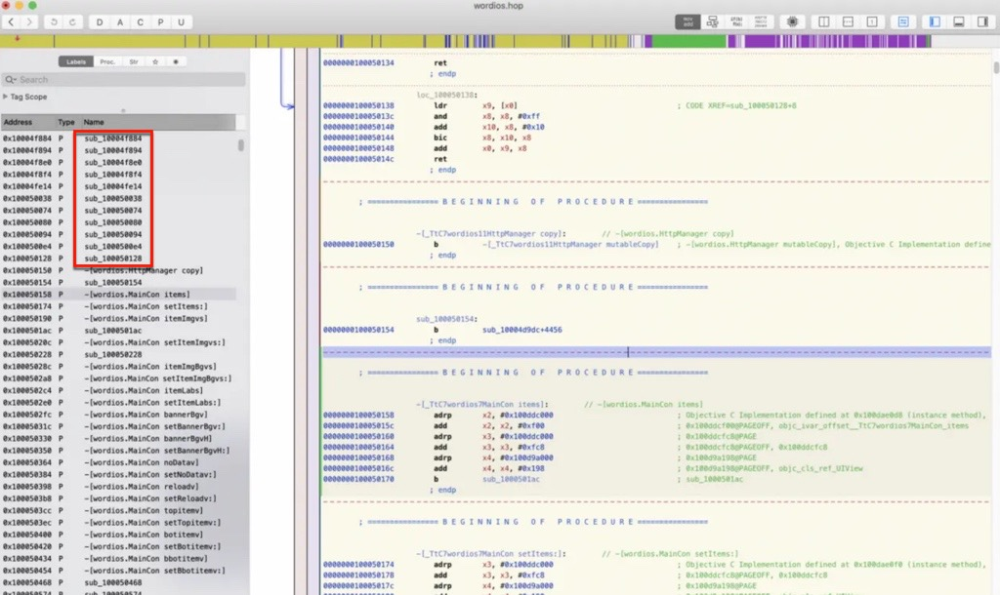

# 代码混淆

iOS安全从代码角度，可以去做：`代码混淆`

* 代码混淆 目的
  * 更好地保护代码，增加逆向破解难度 = 不被轻松地恶意分析破解
* 代码混淆 优缺点
  * 优点
    * 无须变动项目源码
    * 功能灵活可选，根据需要自由组合
  * 缺点
    * 导致安装包体积增大
    * 混淆后的代码有会被编译优化掉的风险
    * 提交审核（AppStore）存在被拒的风险
* 代码混淆方式=子功能模块
  * obf=Obfuscator 类
    * `bcf`=`Bogus Control Flow`=虚假块=伪控制流
    * `fla`=`cff`=`Control Flow Flattening`=控制流展开=控制流平坦化
    * `split`=基本块分割
    * `sub`=`Instructions Substitution`=指令膨胀=指令替换
    * `acd`=anti class-dump=反class-dump
  * `indibran`=indiret branch=基于寄存器的相对跳转，配合其他加固可以彻底破坏IDA/Hopper的伪代码(俗称F5) = 故意制造堆栈不平衡，不能F5，函数内利用寄存器跳转BR X12
  * `strcry`=字符串加密
  * `funcwra`=函数封装
  * 插入垃圾指令
* iOS代码混淆工具
  * `Obfuscator-LLVM` = `ollvm`
  * `iOS Class Guard`
  * `Hikari`
    * 基于ollvm
    * 主页
      * https://github.com/HikariObfuscator/Hikari
        * https://github.com/HikariObfuscator/Hikari/wiki
* iOS代码混淆后的效果
  * 导出头文件后，函数名变乱码
    * 比如：
      * `money`变成`xadsf32`
      * `showMoney`变成`AFAdsaf123`
  * iOS逆向后看到的代码中的函数，都是无名的函数
    * 比如：Hopper逆向app后，有很多函数名都是：sub_xxx，就表示，该函数被混淆了
      * 
