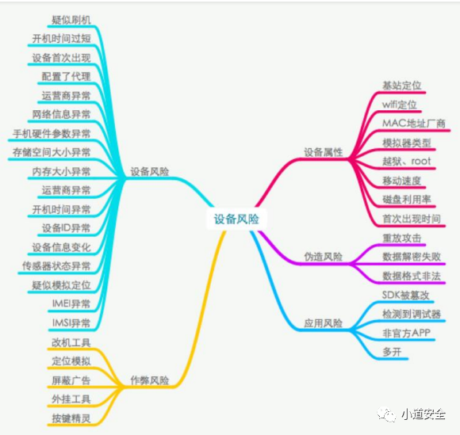
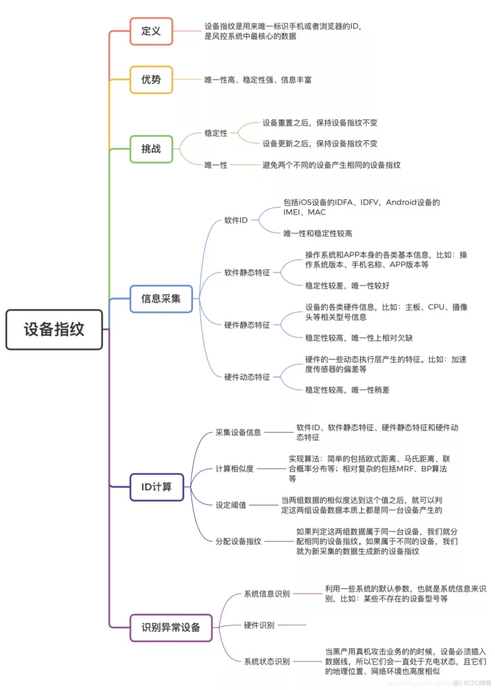
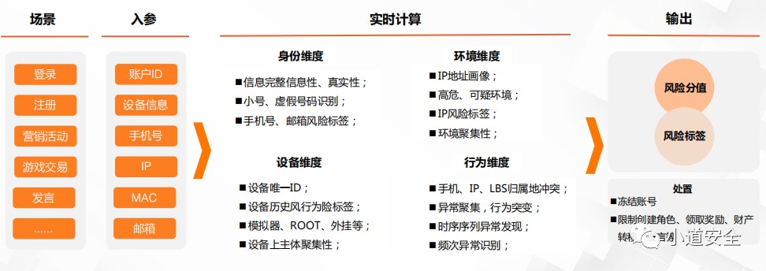
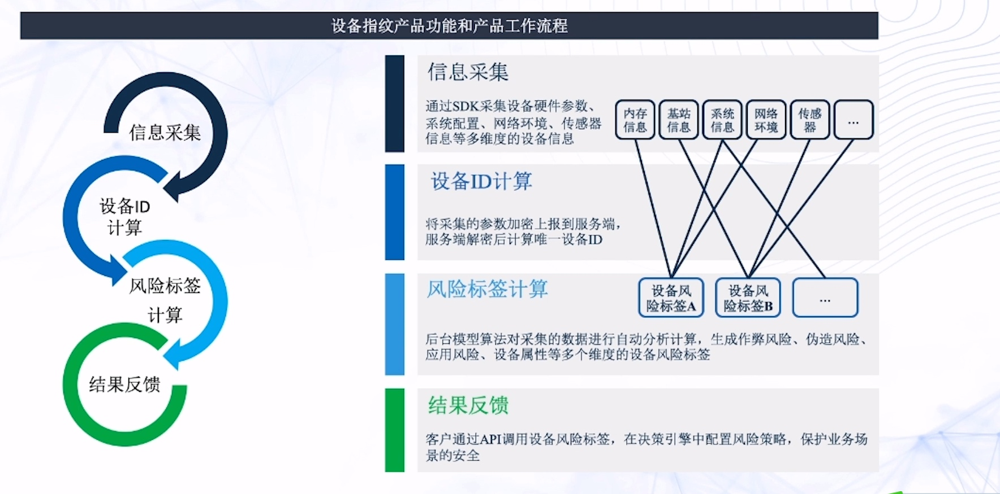

# 设备指纹

* `设备指纹`=`device fingerprint`
  * 背景
    * 各种非法设备和风险，希望能识别并检测出来
      * 模拟器、刷机改机=设备伪造、root越狱、劫持注入、自动注册、羊毛党等
        * 
    * iOS设备
      * 唯一标识符发展历史
        * UDID
        * OpenUDID
        * MAC
        * IDFV
        * IDFA
      * 但都不够好-》可以被改机改掉，不能保证稳定和唯一
  * 是什么：一个唯一的标识符，字符串
    * 设备指纹是指可以用于唯一标识出该设备的设备特征或者独特的设备标识
  * 用途：设备信息唯一性、渠道流量检测、风险设备识别、通用风控策略
  * 概述
    * 
    * 
  * 生成流程
    * 文字
      * 采集信息
        * MAC
        * IMSI
        * IMEI
        * ICCID
        * BSSID
        * 等
      * 计算相似度
        * 常见算法
          * 简单的：欧式距离、马氏距离、联合概率分布等
          * 相对复杂的： MRF（马尔可夫随机场）、BP算法（置信度传播算法）等
    * 图
      * 
